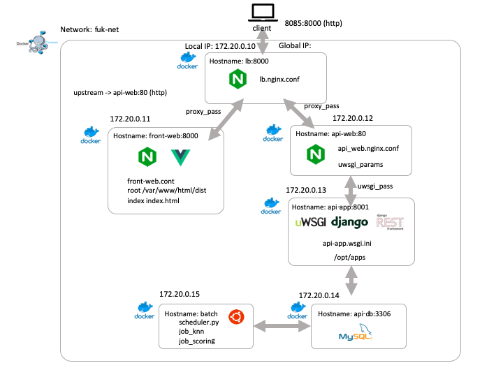

# fuk-project

## prerequisite

- Docker version 19.03.1, build 74b1e89
- docker-compose version 1.24.1, build 4667896b
- ndenv 0.4.0 https://qiita.com/griffin3104/items/a8ae5b271bf9246eeadd
- node.js v10.15.3
- python 3.6.8

## application architecture



## nodejs のインストール

フロントエンド開発には nodejs を利用します。ndenv を入れて仮想環境上での開発をお勧めします。

```
$ brew install ndenv
$ echo 'export PATH="$HOME/.ndenv/bin:$PATH"' >> ~/.bash_profile
$ echo 'eval "$(ndenv init -)"' >> ~/.bash_profile
$ source ~/.bash_profile
$ git clone https://github.com/riywo/node-build.git $(ndenv root)/plugins/node-build

$ ndenv -V # versionが表示されればOK

$ ndenv install v10.15.3
```

## docker & docker-compose のインストール

システムアーキテクチャの構成に docker を利用します。

### docker

https://hub.docker.com/editions/community/docker-ce-desktop-mac  
から docker for mac をインストールする。

```
$ docker -v # Docker version 19.03.1, build xxxxxxが表示されればOK
```

### docker-compose

```
$ curl -L https://github.com/docker/compose/releases/download/1.24.1/docker-compose-`uname -s`-`uname -m` -o /usr/local/bin/docker-compose

$ chmod +x /usr/local/bin/docker-compose
```

## install

```
$ git clone https://github.com/o-ham5/fuk-food.git

$ cd fuk-food

# install for api server development
# venv環境で実行してください。
$ pip install -r requirements.txt

# batchサーバのビルドに時間がかかります。
# batchサーバを触る予定のない人はdocker-compose.ymlでbatchを定義している行を全てコメントアウトしてください。
$ docker-compose build
$ docker-compose up -d

# install for front app development
$ cd front-web
$ ndenv local v10.15.3
$ npm install
$ npm run serve    # start vue devserver
```

## deploy

```
$ cd front-web
$ npm run build
$ cd ..
$ docker-compose build
$ docker-compose up -d
```
