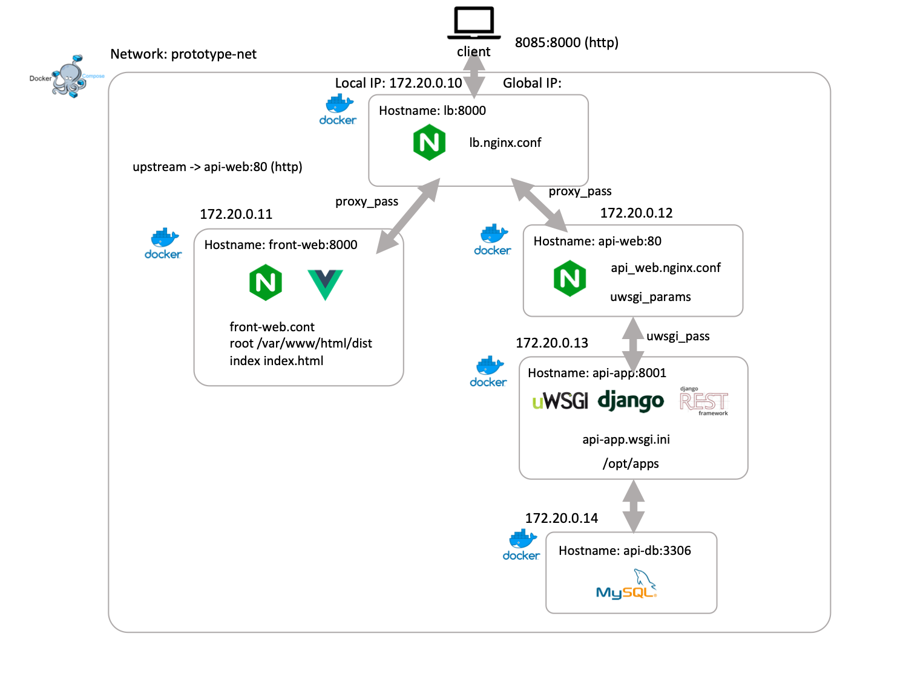

# fuk-project

## prerequisite

- Docker version 19.03.1, build 74b1e89
- docker-compose version 1.24.1, build 4667896b
- ndenv 0.4.0 https://qiita.com/griffin3104/items/a8ae5b271bf9246eeadd
- node.js v10.15.3
- python 3.6.8

## application architecture



## install

```
# install for api server development
$ pip install -r requirements.txt

# install for front app development
$ cd front-web
$ ndenv install v10.15.3
$ ndenv local v10.15.3
$ npm install
```

## start front app development

```
$ cd front-web
$ npm run express    # start express api mock server
$ npm run serve    # start vue devserver
```

## deploy

```
$ cd front-web
$ npm run build
$ cd ..
$ docker-compose build
$ docker-compose up -d
```
